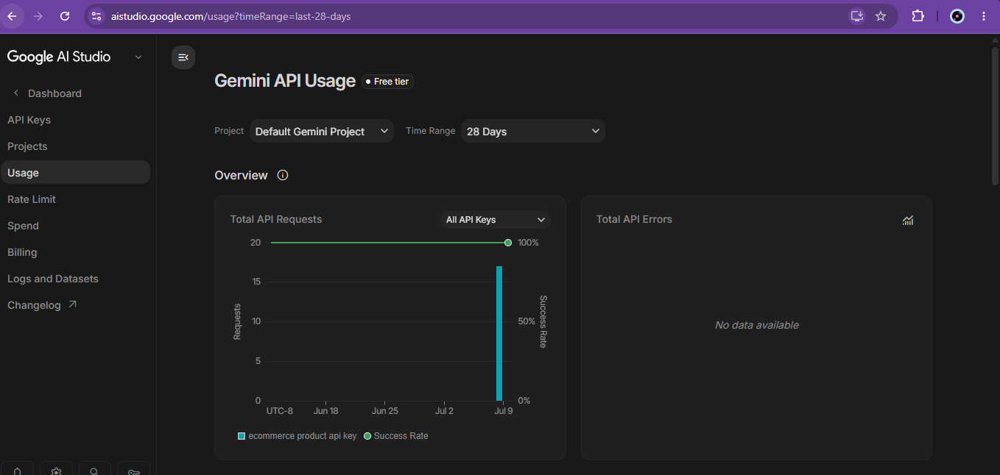
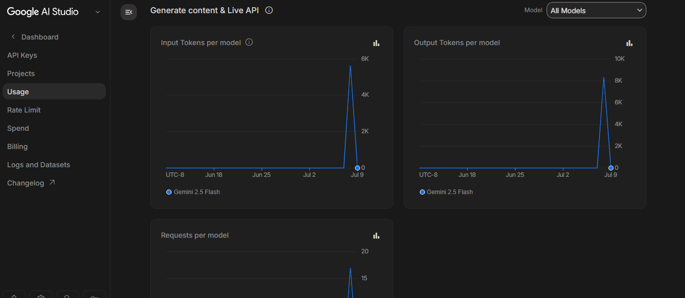
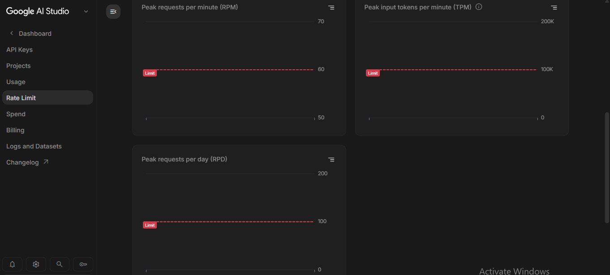
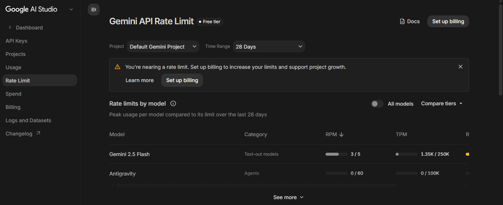
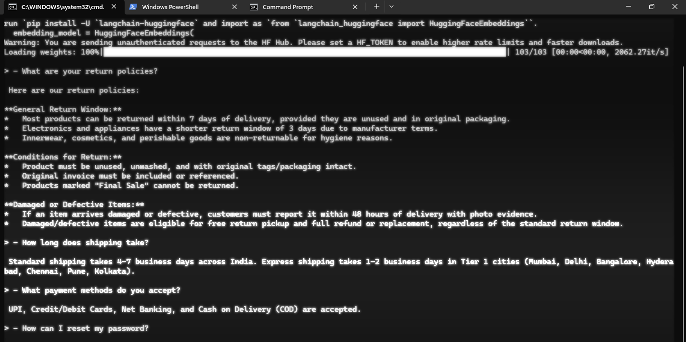

# Ecommerce_Support_Agent

## Problem
- We need a Personalised Chatbot for the organisation
    - LLM's are frozen at trainings
    - So we cannot feed them our personal/private data
    - So instead we use RAG, which helps us to send extra pieces of information with prompt

## Data-types
- policies, company manuals = unstructured data
- the other is structured data in databases, csv, excel = structured data
- orders.csv here has the structured data
- all the .md /docs has unstructured knowledge

## Architecture

User Question
        |
        v
     Router
     /    \
 Order    RAG
 Tool

 Question
    │
    ▼
Regex detects order ID?
    │
    ├── No ──► POLICY (RAG)
    │
    └── Yes
          │
          ▼
Small LLM Intent Classifier
          │
   ┌──────┼─────────┐
   ▼      ▼         ▼
ORDER   POLICY   COMBINED
   │       │         │
   ▼       ▼         ▼
 Tool     RAG    Tool → RAG → LLM

## Core Routing
given a question we have to find whether it is a knowledge based or structured data question
for this we are going to use an hybrid model
- first find the orderId using the "regex", to find the details about the specific order
- ask the llm about the type of question it is = ( COMBINED, ORDER, POLICY ) = LLM output

if llm says order, then use the order id and tool search to give details
if llm says policy, then use the rag and llm to send the response
if combined use both 

## Components
### Router (`router.py`)

The router is responsible for determining how a user's query should be processed. It classifies incoming requests into one of the following categories:

- **Policy Questions** – Questions about shipping, returns, payments, or account support.
- **Order Questions** – Questions requiring structured information from the orders dataset.
- **Combined Questions** – Questions requiring both order information and policy reasoning (basic support implemented).

### 2. Order Tool (`tools.py`)

The order tool provides deterministic access to the `orders.csv` dataset using Pandas.

### 3. RAG Pipeline (`rag.py`)

Policy documents are loaded from Markdown files and processed through a Retrieval-Augmented Generation (RAG) pipeline.
- loading the policy documents (the markdown files in sample_data)
- Splitting them into chunks using `RecursiveCharacterTextSplitter`
- Generating embeddings using the Sentence Transformers embedding model (`all-MiniLM-L6-v2`)
- Storing embeddings in a FAISS vector database
- Performing semantic similarity search for every policy question
- Passing only the retrieved context to Gemini for answer generation

## Tech Stack

- Python
- LangChain
- FAISS
- Gemini
- Pandas

## Chunking Strategy

- RecursiveCharacterTextSplitter
- chunk_size=500
- overlap=100

## Vector Store

- The knowledge is broken down into chunks and a numbered vector is created and stored in a vector database.
FAISS
Reason:
Simple, local, lightweight.

## Model

Gemini 2.5 Flash
Reason:
- I already used this model in previous projects.
- Free API, fast inference, good quality.

## Cases on which Agent worked fine

## Cases on which I did not got correct response
- Can I return ORD1004?
- Is ORD1002 eligible for a return?
- Can I get a refund for ORD1008?
- Is ORD1016 still within the return window?

## Future Improvements

- Currently the chatbot is unable to answer questions that are combined by both RAG and tools search
    Ex: Can I return the ORD1004
- I could work and improve on this combined types of prompts.
- Better intent classification
- Metadata filtering
- Hybrid retrieval
- Retriever caching
